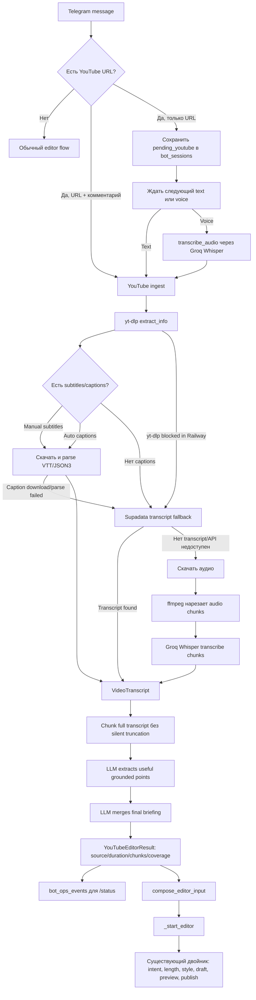

# YouTube ingest для The Persona Factory

## Цель

Добавить в Telegram-бота Persona Factory возможность отправлять YouTube-видео как источник полезных идей, а не как обычный текст.

Пользовательский сценарий:

1. Пользователь смотрит YouTube-видео.
2. Видео ему кажется полезным, интересным или важным.
3. Он отправляет боту ссылку и свой комментарий:
   - что понравилось;
   - что понял для себя;
   - что было новым;
   - какую мысль хочет развить в пост или сохранить как материал.
4. Если пользователь отправил только ссылку, бот не начинает обработку сразу, а ждет следующий текстовый или голосовой комментарий.
5. Если следующий комментарий голосовой, бот сначала расшифровывает голос, затем использует расшифровку как авторский takeaway.
6. Система извлекает из видео только полезную и подтвержденную информацию, отбрасывает рекламу, воду, повторения и вступления.
7. После этого подготовленный материал передается существующему двойнику, который уже умеет делать посты, улучшать текст, развивать идеи и отправлять новые сведения в review.

Главная цель: пользователь должен быстро превращать просмотренные видео в качественный материал для своего Telegram-канала, не копируя руками конспект и не рискуя получить выдуманные факты от LLM.

## Почему не отдельный бот и не отдельный полноценный агент

Отдельный Telegram-бот не нужен, потому что текущий бот уже решает главную задачу: принимает пользовательский ввод, создает draft, предлагает intent, длину, style mode, preview и публикацию.

Отдельный полноценный автономный агент тоже не нужен на первом этапе. YouTube-задача хорошо разделяется на сервисный pipeline:

1. Получить транскрипт видео.
2. Очистить и нормализовать транскрипт.
3. Вытащить grounded notes: полезные идеи только из видео.
4. Соединить эти notes с комментарием пользователя.
5. Передать результат в существующий editor flow двойника.

То есть архитектурно это не новый "мозг", а новый ingestion-адаптер.

Правильная роль нового компонента:

- YouTube ingest отвечает за источник.
- Двойник отвечает за авторский голос, стиль, пост, review и публикацию.

Так система остается проще, дешевле и надежнее.

## Основная функция

Функция называется условно: YouTube ingest.

Она должна уметь:

1. Найти YouTube-ссылку в сообщении.
2. Понять, есть ли рядом с ссылкой комментарий пользователя.
3. Если комментария нет, сохранить состояние `pending_youtube` в сессии бота.
4. Дождаться следующего текстового или голосового сообщения.
5. Если пришел voice, расшифровать его через существующий `transcribe_audio()`.
6. Получить транскрипт YouTube-видео:
   - сначала ручные subtitles;
   - потом automatic captions;
   - если captions нет, скачать аудио и расшифровать его.
7. Разбить длинный транскрипт на chunks.
8. В каждом chunk извлечь только полезные grounded points.
9. Объединить points в итоговый briefing.
10. Сформировать structured input для существующего двойника.
11. Запустить обычный `_start_editor()` flow.

## Пользовательская логика

### Сценарий 1: ссылка плюс комментарий

Пользователь отправляет:

```text
https://youtu.be/example

Мне понравилась мысль, что дисциплина строится не через мотивацию,
а через среду и повторяемую систему. Хочу сделать из этого пост.
```

Бот делает:

1. Находит ссылку.
2. Убирает ссылку из текста.
3. Оставшийся текст считает авторским takeaway.
4. Сразу запускает YouTube ingest.
5. После ingest передает результат двойнику.
6. Пользователь видит обычное меню:
   - улучшить текст;
   - развить идею;
   - запомнить обо мне;
   - правило моего стиля.

### Сценарий 2: только ссылка

Пользователь отправляет:

```text
https://youtu.be/example
```

Бот отвечает:

```text
Ссылку получил. Пришлите текстом или голосом, что именно вам понравилось,
было полезно или стало новым. Если передумали — /cancel.
```

В сессии сохраняется:

```json
{
  "pending_youtube": {
    "url": "https://youtu.be/example"
  }
}
```

Следующее текстовое сообщение используется как takeaway.

### Сценарий 3: ссылка, потом голос

Пользователь отправляет ссылку, затем voice.

Бот делает:

1. Скачивает Telegram voice.
2. Расшифровывает через Groq Whisper.
3. Показывает пользователю распознанный текст.
4. Использует его как takeaway к YouTube-видео.
5. Запускает YouTube ingest.

### Сценарий 4: отмена

Если после ссылки пользователь отправляет:

```text
/cancel
```

или:

```text
отмена
```

бот удаляет `pending_youtube` из сессии и не обрабатывает видео.

## Архитектура



## Компоненты

### `src/bot/handlers.py`

Отвечает за пользовательский Telegram-flow.

Новая логика:

- импортирует:
  - `build_youtube_editor_input`;
  - `extract_youtube_urls`;
  - `strip_youtube_urls`;
  - `YouTubeIngestError`;
- добавляет helper `_start_youtube_editor()`;
- обрабатывает YouTube-ссылки в `on_text()`;
- обрабатывает voice как комментарий к pending YouTube в `on_voice()`;
- добавляет описание функции в `/start` и `/help`.

### `src/bot/session_store.py`

Добавляет новый ключ сессии:

```python
"pending_youtube"
```

Он нужен, чтобы бот помнил ссылку между двумя сообщениями:

1. первое сообщение: только YouTube URL;
2. второе сообщение: текстовый или голосовой takeaway пользователя.

Сессии уже хранятся в Supabase-backed `bot_sessions`, с fallback в memory. Поэтому новый flow не требует отдельной таблицы.

### `src/orchestrator/youtube_ingest.py`

Новый основной модуль функции.

Зоны ответственности:

- найти YouTube URL;
- удалить URL из пользовательского комментария;
- проверить, что URL действительно YouTube;
- получить metadata видео через `yt-dlp`;
- выбрать лучший caption track:
  - сначала manual subtitles;
  - потом automatic captions;
  - сначала preferred languages;
  - потом остальные доступные languages;
- скачать caption-файл;
- распарсить VTT или JSON3;
- если captions нет, скачать audio;
- нарезать audio через `ffmpeg`;
- расшифровать chunks через Groq Whisper;
- собрать `VideoTranscript`;
- разбить длинный transcript на chunks;
- извлечь полезные пункты;
- объединить пункты в final briefing;
- собрать structured input для двойника.

### `src/orchestrator/transcriber.py`

Раньше функция была жестко привязана к Telegram voice:

```python
voice.ogg
audio/ogg
timeout=30
language=ru
```

Теперь она принимает параметры:

- `filename`;
- `content_type`;
- `timeout_seconds`;
- `language`.

Это позволяет использовать тот же Groq Whisper-клиент для:

- Telegram voice;
- YouTube audio chunks.

### `src/orchestrator/memory_ingest.py`

Добавлено важное правило в extraction prompt:

Если текст содержит:

```xml
<author_takeaway>
...
</author_takeaway>

<video_grounded_notes>
...
</video_grounded_notes>
```

то сведения о личности автора можно извлекать только из `<author_takeaway>`.

`<video_grounded_notes>` — это внешний источник, а не биография пользователя.

Это критично, потому что иначе система могла бы принять мысль из видео за убеждение пользователя.

Пример:

Видео говорит:

```text
Предприниматель должен работать 14 часов в день.
```

Пользователь говорит:

```text
Мне не понравилась эта мысль, я наоборот хочу устойчивый режим.
```

Система не должна сохранять правило:

```text
Пользователь считает, что нужно работать 14 часов в день.
```

Она должна опираться только на takeaway пользователя.

### `Dockerfile`

Добавлен `ffmpeg`.

Он нужен только для fallback-сценария, когда у YouTube-видео нет subtitles/captions и приходится скачивать audio.

Без `ffmpeg` нельзя надежно нарезать длинные видео на chunks для Whisper.

### `requirements.txt` и `requirements-bot.txt`

Добавлен:

```text
yt-dlp==2026.6.9
```

`yt-dlp` используется бесплатно:

- для metadata;
- для subtitles/captions;
- для audio fallback.

## Детальная логика извлечения видео

### Шаг 1: определить YouTube URL

Система ищет ссылки вида:

- `https://youtube.com/...`
- `https://www.youtube.com/...`
- `https://m.youtube.com/...`
- `https://music.youtube.com/...`
- `https://youtu.be/...`

Функция:

```python
extract_youtube_urls(text)
```

возвращает список найденных YouTube URL.

Функция:

```python
strip_youtube_urls(text)
```

удаляет URL из текста и оставляет пользовательский комментарий.

### Шаг 2: получить metadata через `yt-dlp`

Функция:

```python
_extract_info(url)
```

вызывает `yt-dlp` в режиме:

```python
download=False
skip_download=True
noplaylist=True
socket_timeout=30
```

Timeout нужен, чтобы Telegram handler не зависал бесконечно, если YouTube или сеть отвечают медленно.

### Шаг 3: выбрать subtitles/captions

Система сначала ищет manual subtitles:

```python
info["subtitles"]
```

Потом automatic captions:

```python
info["automatic_captions"]
```

По языкам используется настройка:

```env
YOUTUBE_CAPTION_LANGUAGES=ru,en
```

По умолчанию приоритет:

1. `ru`
2. `en`
3. остальные доступные языки

По форматам:

1. `vtt`
2. `json3`

### Шаг 4: распарсить captions

Поддерживаются два формата:

```python
parse_vtt(text)
parse_json3(text)
```

Они возвращают список:

```python
TranscriptSegment(
    start=12.5,
    end=16.2,
    text="..."
)
```

Каждый segment сохраняет timestamp, чтобы итоговый briefing мог ссылаться на место в видео.

### Шаг 5: fallback на audio

Если subtitles/captions нет:

1. `yt-dlp` скачивает bestaudio.
2. `ffmpeg` режет аудио на chunks.
3. Каждый chunk сжимается в OGG/Opus:
   - mono;
   - 16 kHz;
   - 24k bitrate.
4. Каждый chunk отправляется в Groq Whisper.
5. Из chunks собирается `VideoTranscript`.

Настройки:

```env
YOUTUBE_AUDIO_CHUNK_SECONDS=600
```

По умолчанию chunk = 10 минут.

Это сделано, чтобы длинные видео не превышали file-size limits speech-to-text API.

## Детальная логика LLM-обработки

### Почему нельзя отдавать весь transcript сразу двойнику

Если видео длинное, например 90 минут, transcript может быть очень большим.

Проблемы прямой передачи:

- много токенов;
- выше шанс потерять важное;
- выше шанс, что LLM начнет обобщать слишком свободно;
- реклама и вода попадут в контекст;
- двойник будет заниматься не своей задачей.

Поэтому сначала нужен отдельный deterministic pipeline подготовки source material.

### Первый LLM-проход: полезные пункты по chunks

Каждый transcript chunk отправляется в prompt:

Цель:

- извлечь только полезные, интересные, новые или practically useful мысли;
- учитывать takeaway пользователя как фильтр важности;
- пропускать рекламу, sponsor blocks, вступления, повторы, пустую мотивацию;
- не добавлять знания вне transcript;
- сохранять timestamp.

Если chunk бесполезный, модель должна вернуть:

```text
НЕТ ПОЛЕЗНЫХ ПУНКТОВ
```

### Второй LLM-проход: final briefing

После обработки chunks система объединяет полезные пункты.

Итоговый briefing должен содержать:

- 5-12 главных идей;
- timestamp или диапазон;
- что совпало с интересом пользователя;
- только факты из extracted points;
- без новых внешних фактов.

### Structured input для двойника

Итог передается двойнику в формате:

```xml
<!--source:youtube-->
ИСТОЧНИК YOUTUBE:
Название: ...
URL: ...
Длительность: ...
Транскрипт: manual_captions/auto_captions/groq_whisper_audio, язык: ...

<author_takeaway>
...
</author_takeaway>

<video_grounded_notes>
...
</video_grounded_notes>

ЗАДАЧА ДЛЯ ДВОЙНИКА:
Используй мой комментарий как главный источник позиции автора.
Факты из видео используй только как материал из источника, без выдумывания.
Не сохраняй факты из видео как сведения обо мне без моего явного подтверждения.
```

Так двойник понимает:

- что является словами пользователя;
- что является внешним источником;
- что нельзя сохранять как личность;
- на чем можно строить пост.

## Бесплатность и стоимость

Цель была сделать функцию максимально бесплатной.

Используемые компоненты:

### Бесплатно внутри Railway runtime

- `yt-dlp`;
- `ffmpeg`;
- собственный Python-код;
- текущая Supabase-сессия;
- текущий Telegram bot flow.

### Free tier / уже существующие API

- Groq Whisper для speech-to-text;
- существующий LLM router проекта:
  - Gemini;
  - Groq;
  - Cohere;
  - OpenRouter.

Новая функция не требует:

- платного YouTube API;
- отдельной базы данных;
- отдельного сервера;
- отдельного Telegram-бота;
- отдельного платного transcription-сервиса.

Важно: если у free tier API закончатся лимиты, функция вернет ошибку так же, как другие LLM/STT функции проекта. Архитектура не делает paid API обязательным.

## Ограничения и риски

### YouTube может блокировать extraction

`yt-dlp` иногда может зависнуть или получить ошибку от YouTube.

Защита:

- `socket_timeout=30`;
- ошибки перехватываются и показываются пользователю;
- `pending_youtube` не удаляется, если обработка упала, чтобы пользовательский takeaway не потерялся.

### У видео может не быть captions

Fallback:

- download audio;
- chunk через `ffmpeg`;
- transcription через Groq Whisper.

### Длинные видео

Видео на 90 минут поддерживаются через:

- transcript chunking;
- audio chunking;
- summary по частям;
- final merge.

Но длинное видео потребует больше времени и больше LLM/STT calls.

### Качество automatic captions

Auto captions могут ошибаться.

Система снижает риск:

- сохраняет timestamps;
- просит LLM не выдумывать;
- использует только transcript;
- не сохраняет video facts как личность пользователя.

### Реклама и вода

LLM prompt явно просит пропускать:

- рекламу;
- sponsor blocks;
- вступления;
- повторы;
- пустую мотивацию;
- воду.

Это не 100% deterministic фильтр, но лучше, чем прямое суммирование всего transcript.

## Что происходит после YouTube ingest

После подготовки briefing система не публикует ничего автоматически.

Она запускает обычный Persona Factory flow:

1. Создается draft.
2. Пользователь выбирает intent:
   - улучшить;
   - развить;
   - запомнить обо мне;
   - правило моего стиля.
3. Пользователь выбирает длину.
4. Пользователь выбирает style mode.
5. Двойник генерирует один основной черновик.
6. Пользователь может править.
7. Пользователь открывает final preview.
8. Только после подтверждения идет публикация.

Это сохраняет текущие гарантии проекта:

- публикация не автоматическая;
- новые сведения не применяются без review;
- двойник использует подтвержденную память и voice examples;
- пользователь контролирует итог.

## Как настройки бота применяются к YouTube-материалу

YouTube ingest не должен выдавать пользователю финальный конспект как конечный результат.

Правильная логика:

1. YouTube ingest готовит структурированный материал.
2. Пользователь выбирает intent в Telegram:
   - `Улучшить текст`;
   - `Развить идею`;
   - `Запомнить обо мне`;
   - `Правило моего стиля`.
3. Если пользователь выбирает `Развить идею`, двойник берет:
   - личную позицию автора из `<author_takeaway>`;
   - факты, примеры и таймкоды из `<video_grounded_notes>`.
4. Пользователь выбирает объем:
   - `Коротко`;
   - `Обычно`;
   - `Раскрыть`.
5. Пользователь выбирает технику подачи:
   - `Мой голос`;
   - `Кратко и ясно`;
   - `Storytelling`;
   - `Покажи процесс`.
6. Только после этого генерируется готовый текст.

Пример ожидаемого поведения:

Пользователь отправляет:

```text
Посмотрел это видео и остался под большим впечатлением!
Автор очень доступно разобрал учение Ибн Араби о 7 уровнях нафса.
Мне стало понятно, как именно устроена наша душа...
```

Потом выбирает:

```text
Развить идею -> Коротко -> Мой голос
```

Двойник должен выдать не список уровней и не технический briefing, а короткий пост от лица автора:

```text
Иногда одно видео может не просто дать информацию, а заставить посмотреть внутрь себя.

Разбор 7 уровней нафса у Ибн Араби напомнил мне, что душа не стоит на месте:
она может быть в плену инстинктов, может начать видеть себя честнее,
а может постепенно двигаться к более глубокому пробуждению.

Для меня это не теория. Это карта внутреннего пути.
```

Если выбран объем `Обычно`, двойник может использовать 1-2 факта или примера из видео.

Если выбран объем `Раскрыть`, двойник может подробнее раскрыть стадии развития, но все равно должен писать пост, а не сухой конспект.

Для этого в `src/orchestrator/brainstorm.py` добавлена source-aware инструкция для `<!--source:youtube-->`:

- `<author_takeaway>` считается позицией автора;
- `<video_grounded_notes>` считается внешним источником фактов и примеров;
- результат должен быть готовым постом;
- XML-теги, URL и служебные детали ingest нельзя показывать;
- факты из видео нельзя выдавать за личные убеждения автора;
- при коротком объеме используется максимум один supporting fact/example из видео.

## Почему video facts не должны автоматически попадать в память

YouTube-видео — внешний источник.

Если автор говорит:

```text
В этом видео мне понравился подход к системности.
```

это может быть сигналом о вкусе или интересе автора.

Но если видео говорит:

```text
Все должны вставать в 4 утра.
```

это не значит, что пользователь верит в это.

Поэтому правило:

- из `<author_takeaway>` можно извлекать личные выводы;
- из `<video_grounded_notes>` нельзя автоматически извлекать личность, beliefs, decisions или regrets;
- если пользователь явно пишет "я теперь хочу так делать", это уже будет в `<author_takeaway>` и может попасть в review.

## Текущие настройки

```env
YOUTUBE_CAPTION_LANGUAGES=ru,en
YOUTUBE_AUDIO_CHUNK_SECONDS=600
YOUTUBE_INGEST_TIMEOUT_SECONDS=900
SUPADATA_API_KEY=
```

### `YOUTUBE_CAPTION_LANGUAGES`

Языки captions в порядке приоритета.

По умолчанию:

```text
ru,en
```

### `YOUTUBE_AUDIO_CHUNK_SECONDS`

Размер audio chunk в секундах для fallback transcription.

По умолчанию:

```text
600
```

Это 10 минут.

### `YOUTUBE_INGEST_TIMEOUT_SECONDS`

Общий timeout всего YouTube ingest: captions/Supadata/audio fallback, chunk extraction и final merge.

По умолчанию:

```text
900
```

Это защита от зависших сетевых запросов и слишком долгой обработки.

### Chunking длинных видео

Transcript не обрезается через `plain[:60000]`.

Правило production-версии:

1. Весь transcript превращается в `plain_text` с timestamps.
2. `plain_text` режется на prompt-safe chunks.
3. Каждый chunk проходит extraction полезных grounded points.
4. Final merge получает только extracted points.
5. Результат сохраняет `processed_chunks`, `total_chunks` и `coverage`.

Если видео слишком длинное и обработка упирается в `YOUTUBE_INGEST_TIMEOUT_SECONDS`, бот возвращает явную ошибку timeout вместо тихого неполного briefing.

## Acceptance criteria

Функция считается рабочей, если:

1. Ссылка + текст запускает YouTube ingest сразу.
2. Только ссылка сохраняет `pending_youtube`.
3. Следующий текст после ссылки запускает YouTube ingest.
4. Следующий voice после ссылки расшифровывается и запускает YouTube ingest.
5. `/cancel` отменяет ожидание комментария.
6. Manual captions используются раньше auto captions.
7. Auto captions используются раньше audio fallback.
8. Audio fallback режет длинное аудио через `ffmpeg`.
9. LLM получает все transcript chunks, а не сырое видео целиком и не silently truncated текст.
10. Итоговый editor input разделяет `<author_takeaway>` и `<video_grounded_notes>`.
11. Memory extraction не сохраняет video notes как личные факты пользователя.
12. После YouTube ingest работает обычный draft flow двойника.
13. `/status` показывает последние YouTube success/error из durable `bot_ops_events`.

## Тестовое покрытие

Добавлен файл:

```text
tests/test_youtube_ingest.py
```

Покрыто:

- извлечение YouTube URL из текста;
- удаление URL из комментария;
- parsing VTT;
- parsing JSON3;
- timestamp formatting;
- сборка structured editor input;
- разделение user takeaway и video grounded notes.

Проверки после реализации:

```bash
.venv/bin/python -m pytest -q
.venv/bin/python -m compileall -q src tests/test_youtube_ingest.py
git diff --check
```

Ожидаемый результат текущей реализации:

```text
88 passed
```

## Дальнейшие улучшения

### 1. Progress updates для длинных видео

Сейчас бот сообщает общий статус.

Можно улучшить:

- "нашел subtitles";
- "скачиваю audio";
- "расшифровываю chunk 2/9";
- "сжимаю полезные идеи";
- "передаю двойнику".

### 2. Хранить YouTube briefing как отдельный source artifact

Сейчас briefing попадает в `journal_entries.raw_text` через draft flow.

Можно добавить отдельную таблицу:

```text
youtube_ingests
```

Поля:

- url;
- title;
- transcript_source;
- transcript_language;
- duration;
- user_takeaway;
- briefing;
- created_at;
- draft_id;

Это поможет в аналитике и повторном использовании.

### 3. Dedup YouTube links

Если одно видео уже разбиралось раньше, можно переиспользовать transcript/briefing.

Потенциальная логика:

- fingerprint по video id + caption language;
- хранить transcript hash;
- если пользователь отправил то же видео, пересуммаризировать только с новым takeaway.

### 4. SponsorBlock

Можно добавить бесплатную интеграцию с SponsorBlock API, чтобы заранее вырезать sponsor segments.

Это повысит качество удаления рекламы, но добавит внешний dependency.

### 5. Production fallback для Railway cloud IP

Локальный `yt-dlp` может работать, а Railway container может получать от YouTube ошибку:

```text
Sign in to confirm you’re not a bot
```

Это происходит из-за cloud/datacenter IP reputation и не лечится установкой `ffmpeg` или обновлением Dockerfile.

Для production нужен fallback через hosted transcript API.

Поддерживаемая переменная:

```env
SUPADATA_API_KEY=...
```

Логика:

1. Сначала пробуем `yt-dlp`.
2. Если YouTube блокирует extraction, пробуем Supadata transcript endpoint.
3. Если captions найдены, но URL истек, скачивание упало или parser не смог разобрать payload, тоже пробуем Supadata.
4. Если Supadata не дал transcript, используем audio fallback через `yt-dlp` + `ffmpeg` + Groq Whisper.
5. Если `SUPADATA_API_KEY` не задан и Railway заблокировал extraction до metadata, бот возвращает понятную ошибку о том, что production fallback не настроен.

Supadata выбран как pragmatic free-tier вариант:

- 100 free requests/month;
- no credit card required;
- transcript endpoint с timestamps;
- API работает с cloud runtime вместо локального scraping.

### 6. Более точные timestamps для audio fallback

Сейчас audio fallback дает timestamp на уровне chunk start.

Можно улучшить, если transcription API возвращает segment timestamps или если использовать локальный Whisper-пайплайн.

### 7. Автоматическое определение языка

Сейчас transcription fallback использует русский язык.

Можно улучшить:

- если captions были на английском, summary все равно на русском;
- для audio fallback определить язык автоматически или пробовать `ru/en`.

## Итоговое решение

Выбранная архитектура:

```text
YouTube ingest adapter -> grounded briefing -> existing Persona Factory editor flow
```

Это лучше, чем отдельный агент, потому что:

- дешевле;
- проще;
- меньше moving parts;
- не дублирует текущий двойник;
- сохраняет review и preview safety;
- не смешивает внешние факты с личностью пользователя;
- работает в Railway production runtime;
- использует бесплатные/open-source инструменты там, где это возможно.
